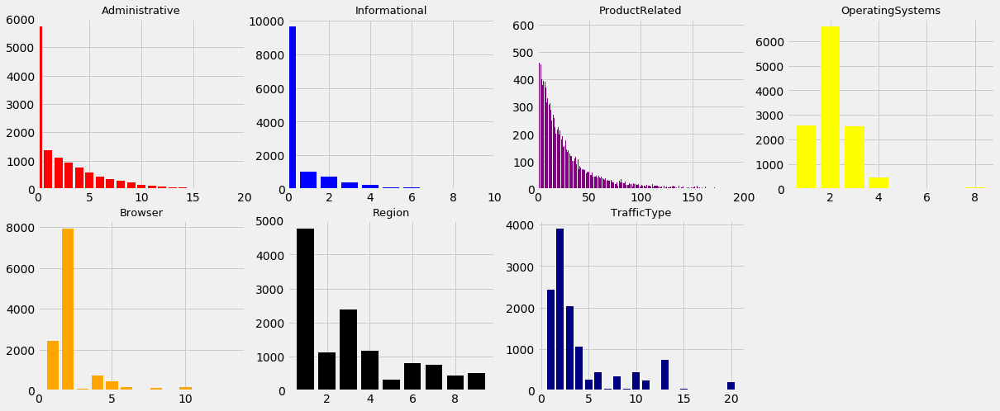
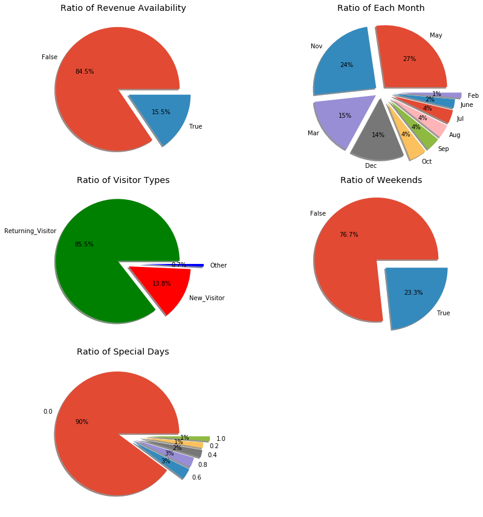
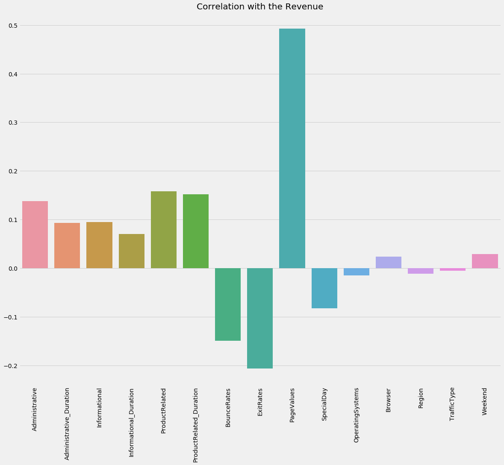
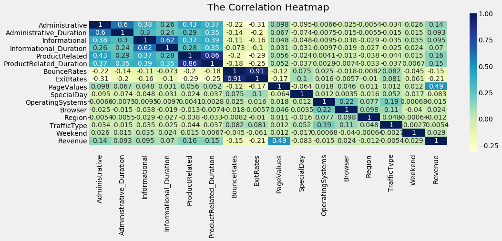
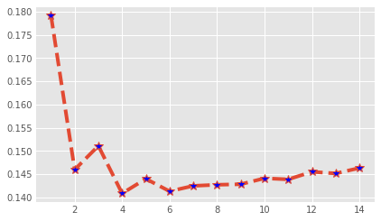
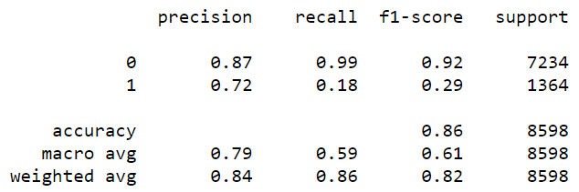

# Revenue-generation-prediction
# Summary

To predict whether revenue would be generated when a customer visit a website page

Based on the features available for a website we need to predict whether a visit from a customer would result in generation in revenue.

By analysis of a customer's behaviour pattern e.g- type of product been searched, duration of stay, we can determine the optimal variation that would corresponds
to maximization of correlation of dependancy of target variable on independent feature.

# Number of customers in various features

Based on the above bar charts we can determine the features in which we have the highest number of customer visits which helps us to understand the customer trend.

We identify Product Related query to be the most sort out.

# Ratios of shares in categorical features with pie chart

Now we need to find the correlation between the features and the target variable

# Correlation

The graph clearly shows heavy dependence of revenue on Page Value

# Heatmap

We can come to conclusion-
1. Revenue depends positively on the PageValue
2. It is negatively dependent ExitRate and BounceRate

# Model building
By clustering together the type of customer according to the feature is the prime focus here.

We can apply clustering algorithm such as KNN here.

KNN can be used for both classification and regression predictive problems. However, it is more widely used in classification problems in the industry. To evaluate any technique we generally look at 3 important aspects:

1. Ease to interpret output

2. Calculation time

3. Predictive Power

We can implement a KNN model by following the below steps:

Load the data

Initialise the value of k

For getting the predicted class, iterate from 1 to total number of training data points

Calculate the distance between test data and each row of training data. Here we will use Euclidean distance as our distance metric since it’s the most popular method. The other metrics that can be used are Chebyshev, cosine, etc.

Sort the calculated distances in ascending order based on distance values

Get top k rows from the sorted array

Get the most frequent class of these rows

Return the predicted class

# Determining the optimal number of neighbors

Neighbors = 4 seems good.

After splitting the data into train and test and applying the KNN algorithm, we conclude-

We arrive at an accuracy of 85.915
